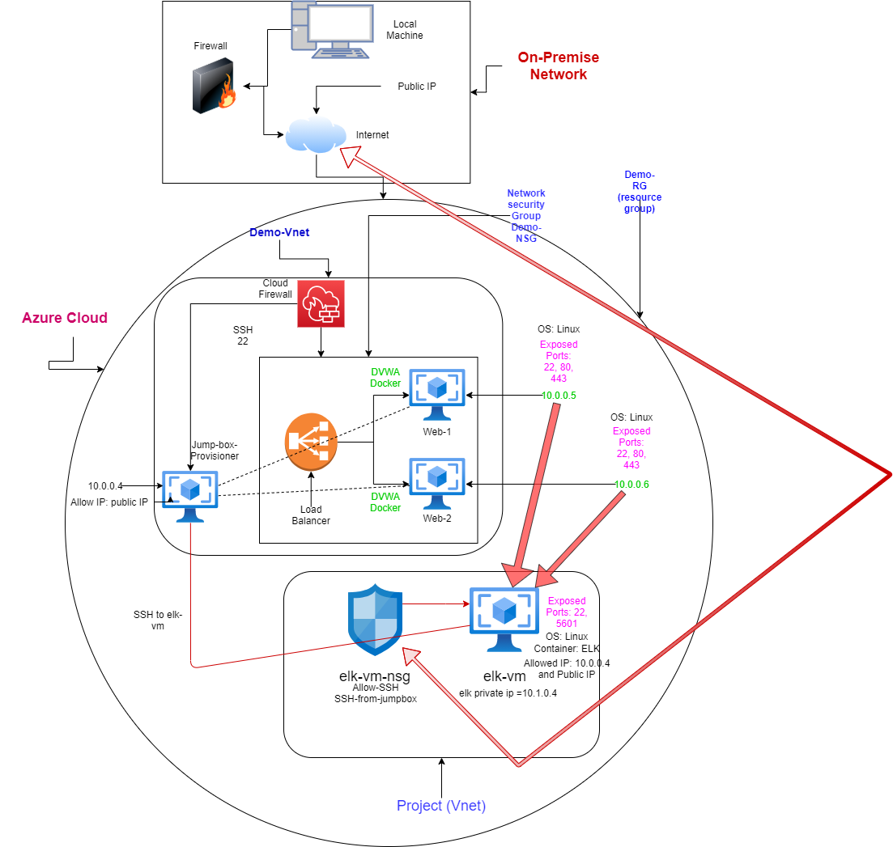
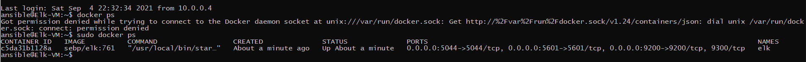

## Automated ELK Stack Deployment

The files in this repository were used to configure the network depicted below.

These files have been tested and used to generate a live ELK deployment on Azure. They can be used to either recreate the entire deployment pictured above. Alternatively, select portions of the YML files may be used to install only certain pieces of it, such as Filebeat.

  - [filebeat_playbook.yml](https://github.com/AgahCS/ELK-Project/blob/main/Ansible/filebeat_playbook.yml "filebeat_playbook.yml")
  - [elk_playbook.yml](https://github.com/AgahCS/ELK-Project/blob/main/Ansible/install_elk_playbook.yml)
  - [metricbeat_playbook.yml](https://github.com/AgahCS/ELK-Project/blob/main/Ansible/metricbeat_playbook.yml)

This document contains the following details:
- Description of the Topology
- Access Policies
- ELK Configuration
  - Beats in Use
  - Machines Being Monitored
- How to Use the Ansible Build

### Description of the Topology

The main purpose of this network is to expose a load-balanced and monitored instance of DVWA, the D*mn Vulnerable Web Application.

Load balancing ensures that the application will be highly available, in addition to restricting access to the network.
- Load balancers protects the system from DDoS attacks by shifting attack traffic. The advantage of a jump box is to give access to the user from a single node that can be secured and monitored.

Integrating an ELK server allows users to easily monitor the vulnerable VMs for changes to the files, system logs, and metrics.
- Filebeat watches for any information that has been changed, and the timestamps of the change.
- Metricbeat records metric and statistical data from the operating system and from services running on the server.

The configuration details of each machine may be found below.

| Name     | Function | IP Address | Operating System |
|----------|----------|------------|------------------|
| Jump Box | Ansible  | 10.0.0.4   | Linux            |
| Web-1    | DVWA     | 10.0.0.5   | Linux            |
| Web-2    | DVWA     | 10.0.0.6   | Linux            |
| Elk-VM   | ELK      | 10.1.0.4   | Linux            |

### Access Policies

The machines on the internal network are not exposed to the public Internet. 

Only the Jumpbox provisioner machine can accept connections from the Internet. Access to this machine is only allowed from the following IP addresses:
- Home Public IP

Machines within the network can only be accessed by Jumpbox.

-The only machine that was allowed access to the 'Elk-VM' is the Jumpbox-Provisioner machine(10.0.0.4) and with the Home Public IP
through port 5601. 

A summary of the access policies in place can be found in the table below.

| Name     | Publicly Accessible | Allowed IP Addresses |
|----------|---------------------|----------------------|
| Jump Box | Yes                 | Personal Public IP   |
| Web-1    | No                  | 10.0.0.4             |
| Web-2    | No                  | 10.0.0.4             |
| Elk-VM   | No                  | 10.0.0.4 & Personal Public IP

### Elk Configuration

Ansible was used to automate configuration of the ELK machine. No configuration was performed manually, which is advantageous because:
Ansible simplifies the process of deploying, configuring, and updating changes through the use of playbooks. 

The playbook implements the following tasks:

  - Install docker.io
  - Install python pip3
  - Install docker module
  - Increase virtual memory
  - Download and launch a docker ELK container w/ ports 5601, 9200, 5044
 
The following screenshot displays the result of running `docker ps` after successfully configuring the ELK instance.

### Target Machines & Beats
This ELK server is configured to monitor the following machines:
- Web-1 10.0.0.5	
- Web-2 10.0.0.6

We have installed the following Beats on these machines:
- Filebeat
- Metricbeat

These Beats allow us to collect the following information from each machine:
- Filebeat: Filebeat is a lightweight shipper for forwarding and centralizing log data. 
Filebeat monitors log files or locations you specify, collects log events, and forwards them either to Elasticsearch or Logstash for indexing.

- Metricbeat: Metricbeat collects metrics and statistics on the system. An example of such is cpu usage, 
which can be used to monitor the system health.

### Using the Playbook
In order to use the playbook, you will need to have an Ansible control node already configured. Assuming you have such a control node provisioned: 

SSH into the control node and follow the steps below:
- Copy the filebeat_playbook.yml and metric_playbook.yml to your /etc/ansible/roles.
- Update the host file to include the webservers and 'Elk-Vm'
- Run the playbook, and navigate to 'http://[your.VM.IP]:5601/app/kibana' to check that the installation worked as expected.

- Which file is the playbook? Where do you copy it?
- Which file do you update to make Ansible run the playbook on a specific machine? How do I specify which machine to install the ELK server on versus which to install Filebeat on?
By adding a private IP under "servers" you can specify which machine to install.
- Which URL do you navigate to in order to check that the ELK server is running?
Go to http://[your.VM.IP]:5601/app/kibana

User Commands:
  - ssh azadmin@jumpbox(Public IP)
  - sudo docker container list -a (list ansible containers)
  - sudo docker start container (name of the container?ID)
  - sudo docker attach container (name of the container/ID)
  - cd /etc/ansible/ (path to ansible)
  - ansible-playbook elk.yml (configures Elk-Server and starts the Elk container on the Elk-Server) 
  - cd /etc/ansible/roles/
  - ansible-playbook filebeat-playbook.yml (installs Filebeat and Metricbeat)
  - navigate to 'http://[your.VM.IP]:5601' for ELK server. 
